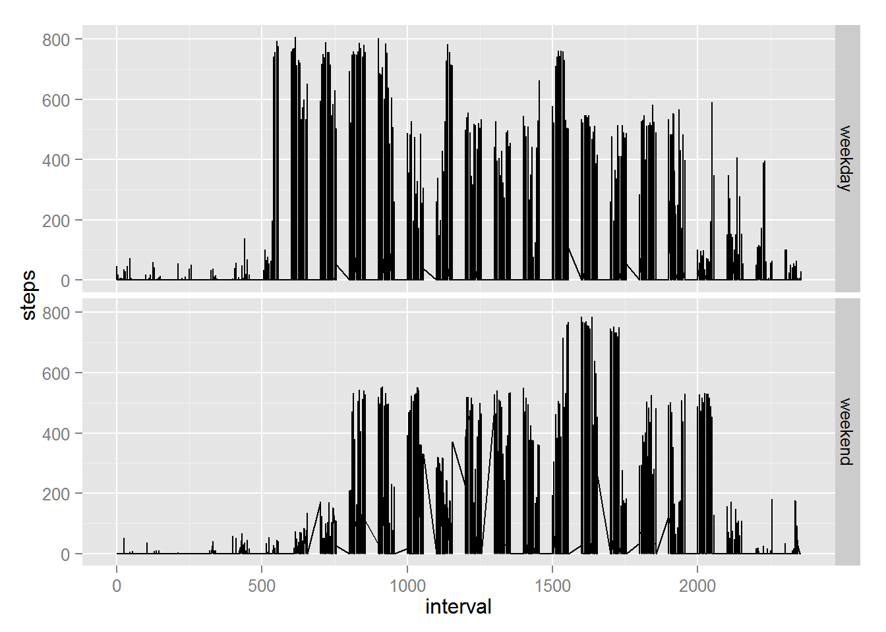

```r
### Check if zip file exists on working directory and if not, it downloads it
if (!file.exists("repdata-data-activity.zip")) {
       fileUrl <- "https://d396qusza40orc.cloudfront.net/repdata%2Fdata%2Factivity.zip"
       download.file(fileUrl, destfile="./repdata-data-activity.zip") 
}

# Unzip the zip file getdata-projectfiles-UCI HAR Dataset.zip  
unzip("repdata-data-activity.zip")

# Insert the test dataset into R as test
activity <- read.csv("activity.csv", header = TRUE, sep = ",", quote = "\"")
```


```r
# Calculate the total number of steps per day
total <- aggregate(steps ~ date,activity,sum)

# Create the histogram of total number of steps taken per day
hist(total$steps, breaks=10, main = "Histogram of total number of steps taken 
     per day", xlab = "Total number of steps", ylab="Total days")
```

 

The mean & Median of total number of steps per day are:


```r
library(plyr)

# Create a table containing average & median number of steps per day
ddply(na.omit(activity),.(date), summarise, mean_steps=mean(steps),
      median_steps=median(steps)) 
```

```
##          date mean_steps median_steps
## 1  2012-10-02     0.4375            0
## 2  2012-10-03    39.4167            0
## 3  2012-10-04    42.0694            0
## 4  2012-10-05    46.1597            0
## 5  2012-10-06    53.5417            0
## 6  2012-10-07    38.2465            0
## 7  2012-10-09    44.4826            0
## 8  2012-10-10    34.3750            0
## 9  2012-10-11    35.7778            0
## 10 2012-10-12    60.3542            0
## 11 2012-10-13    43.1458            0
## 12 2012-10-14    52.4236            0
## 13 2012-10-15    35.2049            0
## 14 2012-10-16    52.3750            0
## 15 2012-10-17    46.7083            0
## 16 2012-10-18    34.9167            0
## 17 2012-10-19    41.0729            0
## 18 2012-10-20    36.0938            0
## 19 2012-10-21    30.6285            0
## 20 2012-10-22    46.7361            0
## 21 2012-10-23    30.9653            0
## 22 2012-10-24    29.0104            0
## 23 2012-10-25     8.6528            0
## 24 2012-10-26    23.5347            0
## 25 2012-10-27    35.1354            0
## 26 2012-10-28    39.7847            0
## 27 2012-10-29    17.4236            0
## 28 2012-10-30    34.0938            0
## 29 2012-10-31    53.5208            0
## 30 2012-11-02    36.8056            0
## 31 2012-11-03    36.7049            0
## 32 2012-11-05    36.2465            0
## 33 2012-11-06    28.9375            0
## 34 2012-11-07    44.7326            0
## 35 2012-11-08    11.1771            0
## 36 2012-11-11    43.7778            0
## 37 2012-11-12    37.3785            0
## 38 2012-11-13    25.4722            0
## 39 2012-11-15     0.1424            0
## 40 2012-11-16    18.8924            0
## 41 2012-11-17    49.7882            0
## 42 2012-11-18    52.4653            0
## 43 2012-11-19    30.6979            0
## 44 2012-11-20    15.5278            0
## 45 2012-11-21    44.3993            0
## 46 2012-11-22    70.9271            0
## 47 2012-11-23    73.5903            0
## 48 2012-11-24    50.2708            0
## 49 2012-11-25    41.0903            0
## 50 2012-11-26    38.7569            0
## 51 2012-11-27    47.3819            0
## 52 2012-11-28    35.3576            0
## 53 2012-11-29    24.4688            0
```

Average daily activity pattern


```r
### Create a dataset of average steps per interval
int.steps <- ddply(na.omit(activity),.(interval), summarise, 
                   mean_steps=mean(steps)) 

### Create a column indicating the number of characters that valiable interval
#   contains
int.steps$nchar <- nchar(int.steps$interval)

### Create a column named "interval2" that include some leading 0's depending
### on number of characters of of nchar valiable column
int.steps$interval2[int.steps$nchar==1]  <- '000'
int.steps$interval2[int.steps$nchar==2]  <- '00'
int.steps$interval2[int.steps$nchar==3]  <- '0'
int.steps$interval2[int.steps$nchar==4]  <- ''

### Modify the interval2 column so all entries have 4 characters
int.steps$interval2 <- paste(int.steps$interval2,int.steps$interval,sep='')

### Modify the interval2 column so it looks exactly like a time variable
int.steps$interval2 <- paste(substr(int.steps$interval2,1,2),':', 
                             substr(int.steps$interval2,3,4),':','00',sep="")

### Transform interval2 column to a time variable
int.steps$interval2 <- as.POSIXct(int.steps$interval2, format="%H:%M:%S")

### Make the time series plot of the 5-min intervals
plot(int.steps$interval2, int.steps$mean_steps, type='l', xlab="Time of Day",
     ylab="Total number of steps", main="Average daily activity pattern")
```

 

```r
### Order the above dataset by average number of steps
int.steps <- int.steps[order(int.steps$mean_steps),]  
```

The 5 min interval that contains the maximum number of steps is 

```r
# Display the maximum number of steps 
int.steps[nrow(int.steps),]$interval
```

```
## [1] 835
```
with 

```r
# Calculate the average number of steps for the specific interval
round(int.steps[nrow(int.steps),]$mean_steps,2)
```

```
## [1] 206.2
```
The total number of rows that contain a missing values are:

```r
# Display the number of rows that contain missing values
nrow(activity[!complete.cases(activity),])
```

```
## [1] 2304
```

In order to handle the missing values of steps i decided to replace the missing 
value with the average steps taken for the specific interval


```r
# Create a dataset test by copying activity
test <- activity

# Replace NA values in steps variable with the average of the specific interval
test$steps <- ifelse(is.na(test$steps),
        int.steps$mean_steps[match(activity$interval, int.steps$interval)],
        test$steps)
```

The mean & Median of total number of steps (imputed data) per day are:


```r
# Calculate the total number of steps per day
total2 <- aggregate(steps ~ date,test,sum)

# Create a table containing average & median number of steps per day
ddply(na.omit(test),.(date), summarise, mean_steps=mean(steps),
      median_steps=median(steps)) 
```

```
##          date mean_steps median_steps
## 1  2012-10-01    37.3826        34.11
## 2  2012-10-02     0.4375         0.00
## 3  2012-10-03    39.4167         0.00
## 4  2012-10-04    42.0694         0.00
## 5  2012-10-05    46.1597         0.00
## 6  2012-10-06    53.5417         0.00
## 7  2012-10-07    38.2465         0.00
## 8  2012-10-08    37.3826        34.11
## 9  2012-10-09    44.4826         0.00
## 10 2012-10-10    34.3750         0.00
## 11 2012-10-11    35.7778         0.00
## 12 2012-10-12    60.3542         0.00
## 13 2012-10-13    43.1458         0.00
## 14 2012-10-14    52.4236         0.00
## 15 2012-10-15    35.2049         0.00
## 16 2012-10-16    52.3750         0.00
## 17 2012-10-17    46.7083         0.00
## 18 2012-10-18    34.9167         0.00
## 19 2012-10-19    41.0729         0.00
## 20 2012-10-20    36.0938         0.00
## 21 2012-10-21    30.6285         0.00
## 22 2012-10-22    46.7361         0.00
## 23 2012-10-23    30.9653         0.00
## 24 2012-10-24    29.0104         0.00
## 25 2012-10-25     8.6528         0.00
## 26 2012-10-26    23.5347         0.00
## 27 2012-10-27    35.1354         0.00
## 28 2012-10-28    39.7847         0.00
## 29 2012-10-29    17.4236         0.00
## 30 2012-10-30    34.0938         0.00
## 31 2012-10-31    53.5208         0.00
## 32 2012-11-01    37.3826        34.11
## 33 2012-11-02    36.8056         0.00
## 34 2012-11-03    36.7049         0.00
## 35 2012-11-04    37.3826        34.11
## 36 2012-11-05    36.2465         0.00
## 37 2012-11-06    28.9375         0.00
## 38 2012-11-07    44.7326         0.00
## 39 2012-11-08    11.1771         0.00
## 40 2012-11-09    37.3826        34.11
## 41 2012-11-10    37.3826        34.11
## 42 2012-11-11    43.7778         0.00
## 43 2012-11-12    37.3785         0.00
## 44 2012-11-13    25.4722         0.00
## 45 2012-11-14    37.3826        34.11
## 46 2012-11-15     0.1424         0.00
## 47 2012-11-16    18.8924         0.00
## 48 2012-11-17    49.7882         0.00
## 49 2012-11-18    52.4653         0.00
## 50 2012-11-19    30.6979         0.00
## 51 2012-11-20    15.5278         0.00
## 52 2012-11-21    44.3993         0.00
## 53 2012-11-22    70.9271         0.00
## 54 2012-11-23    73.5903         0.00
## 55 2012-11-24    50.2708         0.00
## 56 2012-11-25    41.0903         0.00
## 57 2012-11-26    38.7569         0.00
## 58 2012-11-27    47.3819         0.00
## 59 2012-11-28    35.3576         0.00
## 60 2012-11-29    24.4688         0.00
## 61 2012-11-30    37.3826        34.11
```

It seems that now there are a few more days that previously had missing values on steps. In general, all days that have have missing values, do not have any valid
measurement (all measurements for these days contain missing values)


```r
# Create a histogram of the total number of steps taken each day.
par(mfrow=c(1,1))

hist(total2$steps, breaks=15, main = "Histogram of total number of steps \n taken 
     per day (with imputed data)", xlab = "Total number of steps", ylab="Total days", cex.main=0.7, ylim=c(0,25))
```

 


It seems that the only change that occures when we imput data to the missing 
values of the dataset, is that the center of distibution is much higher i.e.
the ~ 10000 steps set rises from 16 to 24 total days


```r
### Change the date variable to date format.
activity$date <- as.Date(activity$date)

### Create a new variable that display the day of the date variable
activity$weekday <- weekdays(activity$date)

### Change the day name to weekday or weekend respectively --Greek lang--
activity$weekday[activity$weekday == "Δευτέρα"] <- "weekday"
activity$weekday[activity$weekday == "Τρίτη"] <- "weekday"
activity$weekday[activity$weekday == "Τετάρτη"] <- "weekday"
activity$weekday[activity$weekday == "Πέμπτη"] <- "weekday"
activity$weekday[activity$weekday == "Παρασκευή"] <- "weekday"
activity$weekday[activity$weekday == "Σάββατο"] <- "weekend"
activity$weekday[activity$weekday == "Κυριακή"] <- "weekend"

### Change weekday variable to a factor variable
activity$weekday <- as.factor(activity$weekday)

### Plot the histogram of total number of steps taken per day (with imputed data)
par(mfrow=c(1,1))
hist(total2$steps, breaks=15, main = "Histogram of total number of steps \n taken 
     per day (with imputed data)", xlab = "Total number of steps", ylab="Total             days", cex.main=0.7, ylim=c(0,25))
```

 


Panel plot containing a time series plot of the 5-minute interval (x-axis) and
the average number of steps taken, averaged across all weekday days or weekend
days (y-axis)


```r
# load the ggplot library
library(ggplot2)

# Display the time series plot of the 5-min intervals for weekends & weekdays 
p <- ggplot(na.omit(activity), aes(interval, steps)) + geom_line()
p + facet_grid(weekday ~ .)
```


 
